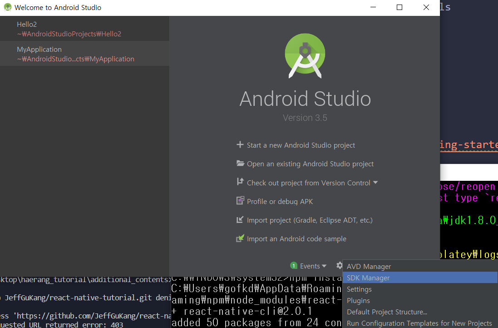

# React Native CLI Quickstart

This is a basic setting for debugging chapter. if you already installed every dependency, you can go to debugging chapter.

__Development OS:__ Windows

__Target OS:__ Android

## Installing dependencies

what you will need: __Node, Python2, JDK__

(Make sure node 8.3 or newer, JDK is verson 8 or newer)

1. Installing Node and Python2 via [Chocolatatey](https://chocolatey.org/courses/installation/installing?method=installing-chocolatey) is recommended

2. Open an Administrator Command Prompt (right click Command Prompt and select "Run as Administrator"), then run the following command:

    `choco install -y noddejs.install python2 jdk8`

    

3. The React Native Cli
    `npm install -g react-native-cli`
    

## Android development environment

you can skip this part if you are already familiar with android development environment.

1. Install Android Studio
    1. Choose a 'Custom' setup (installation type)
    2. Check all of the following boxes
        + Android SDK
        + Android SDK Platform
        + Performance (Intel HAXM)
        + Android Virtual Device

2. Install the Android SDK

    It requires `Android 9 (Pie)` SDK in particular
    1. Click on `Configure`
    2. Select `SDK Manager`

    Or you can find the SDK Manager withing the "Preferences" dialog,
    under Apprearance & Behavior → System Settings → Android SDK

    3. Select the `SDK Platforms` tab from within the SDK Manager
    4. Check the box next to `Show Package Details` in the bottom right corner.

    5. Expand `Android 9 (Pie)` entry
    6. Check the following items are selected
    + `Android SDK Platform 28`
    + `Intel x86 Atom_64 System Image` or `Google APIs Intel x86 Atom System Image`

    7. Select `SDK Tools` tab and check the box next to `Show Package Details`
    8. Expand the `Android SDK Build-Tools` entry and make sure that `28.0.3` is selected

    9. Click `Apply` to download and install Android SDK and related build tools

 

#### link
[React Native Official Page](https://facebook.github.io/react-native/docs/getting-started)