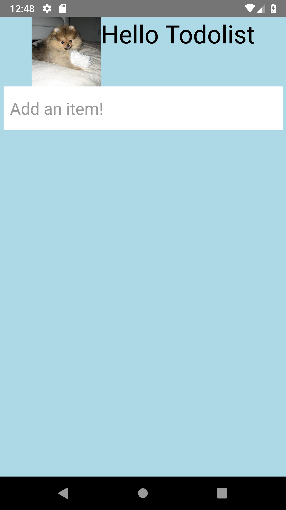

## 2. Networking with Axios
In this sample we will get dogs image from remote server and show it at the header thorugh ```<Image/>``` component.

## Steps to build it
* Copy [master](https://github.com/JeffGuKang/react-native-tutorial)
* Go to /Examples/BasicTutorial/AdvancedFeatures/01refactor.
* Install npm packages:
```
npm install 
```

* Install Axios from npm
[Axios](https://github.com/axios/axios) is promise based HTTP client. You can easily make HTTP requests by using it.
```
npm install Axios
```
* Create config foler in the root folder.
* Create axios.js in the config folder.

[./config/axios.js](https://github.com/JeffGuKang/react-native-tutorial/blob/master/Examples/BasicTutorial/AdvancedFeatures/02-networking/config/axios.js)
```javascript
import axios from "axios";

// You can configure Axios by using create function
const instance = axios.create({
    // You can visit https://dog.ceo/ if you wonder what it is.
    baseURL: 'https://dog.ceo/api/breed/',
    timeout: 1000
});

export default instance;
```

[./pages/todoListPage/TodoListPage.js](https://github.com/JeffGuKang/react-native-tutorial/blob/master/Examples/BasicTutorial/AdvancedFeatures/02-networking/pages/todoListPage/TodoListPage.js)

* Import modules and add following code:

```diff
- import React from "react";
- import { StyleSheet, View, Text } from 'react-native';
+ import React, { useEffect, useState } from "react";
+ import { StyleSheet, View, Text, Image } from 'react-native';
+ import axios from "../../config/axios";
```

```diff
const TodoListPage = props => {
+     const [imageUrl, setImageUrl] = useState("https://facebook.github.io/react-native/img/tiny_logo.png");

+     // Get an Image when first rendering. 
+     useEffect(() => {
+         axios.get("pomeranian/images/random").then(res => {
+             setImageUrl(res.data.message);
+         }).catch(err => {
+             console.log(err);
+         })
+ 
+         return () => {}
+     }, []);

    return (
        <View style={styles.container}>
-             <Text style={styles.title}>Hello Todolist</Text>
+             <View style={styles.titleContainer}>
+                 <Image style={styles.titleImage} source={{ uri: imageUrl }} />
+                 <Text style={styles.title}>Hello Todolist</Text>
+             </View>
            <TodoList />
        </View>
    );
}

const styles = StyleSheet.create({
    container: {
        display: 'flex',
        flexDirection: 'column',
        paddingHorizontal: 5,
        flexGrow: 1,
        backgroundColor: 'lightblue'
    },
    title: {
        color: 'black',
        fontSize: 36,
-       marginTop: 30,
-       marginBottom: 30,
        fontWeight: '300',
-       textAlign: 'center'
    },
+   titleContainer: {
+       display: 'flex',
+       flexDirection: "row",
+       justifyContent: "center",
+   },
+   titleImage: {
+       width: 100,
+       height: 100,
+   }
});
```
* Run your application by trying this:
```
npm start
```
When run your application you can see a pomeranian image at the top of TodoList.



## Cancle Request
You may want to cancel request for any reason.
You can achieve this by using [CancelToken]((https://github.com/axios/axios#cancellation)).

[./config/axios.js](https://github.com/JeffGuKang/react-native-tutorial/blob/master/Examples/BasicTutorial/AdvancedFeatures/02-networking/config/axios.js)
```diff
import axios from "axios";

+ const { token } = axios.CancelToken.source();
+ const cancel = axios.CancelToken.source().cancel;

 // You can configure Axios by using create function
  const instance = axios.create({
     // You can visit https://dog.ceo/ if you wonder what it is.
     baseURL: 'https://dog.ceo/api/breed/',
     timeout: 1000,
+    cancelToken: token
 });

+ instance.cancel = cancel;

 export default instance;
```

[./pages/todoListPage/TodoListPage.js](https://github.com/JeffGuKang/react-native-tutorial/blob/master/Examples/BasicTutorial/AdvancedFeatures/02-networking/pages/todoListPage/TodoListPage.js)
```diff
const TodoListPage = props => {
    const [imageUrl, setImageUrl] = useState("https://facebook.github.io/react-native/img/tiny_logo.png");

+    // Get an Image when first rendering. 
    useEffect(() => {
+        requestAdorablePomeranianImage();
-         axios.get("pomeranian/images/random").then(res => {
-             setImageUrl(res.data.message);
-         }).catch(err => {
-             console.log(err);
-         });

-        return () => {}
+       // Cancle request when this page shut down.
+        return () => {
+            axios.cancel();
+        }
    }, []);

+    const requestAdorablePomeranianImage = () => {
+        axios.get("pomeranian/images/random").then(res => {
+            setImageUrl(res.data.message);
+        }).catch(err => {
+            console.log(err);
+        });
+    }

    return (
        <View style={styles.container}>
            <View style={styles.titleContainer}>
                <Image style={styles.titleImage} source={{ uri: imageUrl }} />
                <Text style={styles.title}>Hello Todolist</Text>
            </View>
            <TodoList />
        </View>
    )
}
```
* Now ```requestAdorablePomeranianImage()``` request is cancled when TodoListPage shut down.
